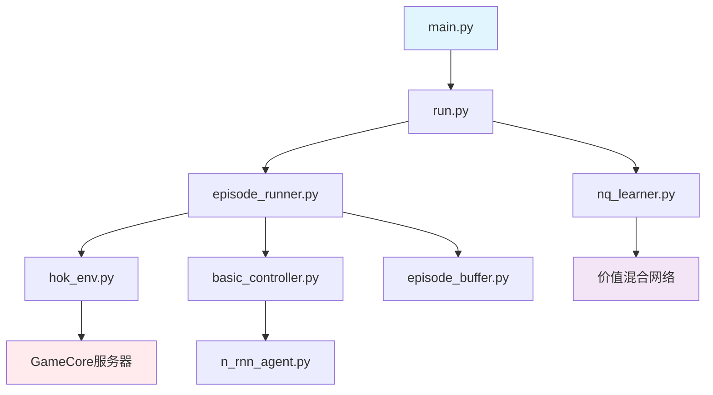

# 简介

## 前言

腾讯多智能体迷你环境是一个基于电子游戏构建的开放环境，让研究人员能够仅使用本地算力开发和验证多智能体算法。

在腾讯多智能体迷你环境中，你需要通过算法训练多个英雄与野怪战斗。任务结束时，野怪的剩余血量将作为评估指标。在开发指南中，我们提供了如何将VDN、QMIX、QATTEN和QPLEX四种算法集成到环境中的示例，并展示了一些实验结果。最后，代码包中提供了VDN的示例代码。

---

## 环境介绍

### 地图
我们的环境包含智能体英雄和野怪。智能体英雄和野怪的分布如下图所示，蓝点代表智能体英雄，红点代表野怪。任务开始时，智能体英雄和野怪将自动在指定位置生成。


### 英雄
| 名称 | ID | 血量 | 普攻范围 | 技能类型1 | 技能类型2 | 技能类型3 |
| :--: | --: | :----: | :------------: | :--------: | :--------: | :--------: |
| **庄周** | 11301 | 7738 | 2800 | 方向性技能 | 方向性技能 | 目标技能（自释放） |
| **狄仁杰** | 13301 | 5706 | 8000 | 方向性技能 | 方向性技能 | 方向性技能 |
| **貂蝉** | 14101 | 5609 | 6000 | 方向性技能 | 方向性技能 | 目标技能（自释放） |
| **孙悟空** | 16701 | 7843 | 3000 | 目标技能（自释放） | 方向性技能 | 目标技能（自释放） |
| **曹操** | 12801 | 8185 | 2800 | 方向性技能 | 方向性技能 | 目标技能（自释放） |

### 野怪
<table>
  <tr>
    <th>ID</th>
    <td>12202</td>
  </tr>
  <tr>
    <th>血量</th>
    <td>30000</td>
  </tr>
</table>

[这里](https://kaiwu-assets-1258344700.file.myqcloud.com/fe-assets/kaiwu-doc/open-competition-2024/multiagent/mini-hok-demo.mp4)是一个展示不同怪物的视频。

---

## 代码结构

### 项目整体架构

本项目基于PyTorch和Sacred构建，参考了SMAC环境的代码实现。整体架构采用模块化设计，便于扩展和维护。

```
MAS-HOK/
├── src/                          # 主要源代码目录
│   ├── main.py                   # 程序入口，处理配置和启动训练
│   ├── config/                   # 配置文件目录
│   │   ├── default.yaml          # 默认配置参数
│   │   ├── algs/                 # 算法配置
│   │   │   ├── vdn.yaml          # VDN算法配置
│   │   │   └── avdn.yaml         # AVDN算法配置
│   │   └── envs/                 # 环境配置
│   ├── envs/                     # 环境相关代码
│   │   ├── multiagentenv.py      # 多智能体环境基类
│   │   └── hok/                  # 王者荣耀环境实现
│   │       ├── hok_env.py        # 环境主类，实现多智能体交互接口
│   │       └── hok_game/         # 游戏核心模块
│   │           ├── client/       # 客户端通信
│   │           ├── conf/         # 配置文件
│   │           ├── agent/        # 智能体相关
│   │           └── protocol/     # 通信协议
│   ├── controllers/              # 智能体控制器
│   │   ├── basic_controller.py   # 基础多智能体控制器
│   │   └── n_controller.py       # N智能体控制器
│   ├── modules/                  # 神经网络模块
│   │   ├── agents/               # 智能体网络
│   │   │   └── n_rnn_agent.py    # RNN智能体网络
│   │   └── mixers/               # 价值函数混合网络
│   │       ├── vdn.py            # VDN混合器
│   │       ├── nmix.py           # N-Mix混合器
│   │       └── qatten.py         # Q-Attention混合器
│   ├── learners/                 # 学习器模块
│   │   └── nq_learner.py         # Q学习训练器
│   ├── runners/                  # 运行器模块
│   │   └── episode_runner.py     # 回合运行器，处理采样和交互
│   ├── components/               # 组件模块
│   │   ├── episode_buffer.py     # 经验回放缓冲区
│   │   ├── action_selectors.py   # 动作选择器（epsilon-greedy等）
│   │   ├── epsilon_schedules.py  # epsilon衰减策略
│   │   └── transforms.py         # 数据变换工具
│   ├── run/                      # 训练运行逻辑
│   │   └── run.py                # 主训练循环
│   └── utils/                    # 工具函数
│       ├── logging.py            # 日志工具
│       ├── rl_utils.py           # 强化学习工具
│       └── th_utils.py           # PyTorch工具
├── docs/                         # 文档目录
│   └── CODE_GUIDE.md             # 详细开发指南
├── results/                      # 训练结果保存目录
├── static/                       # 静态资源（图片等）
├── requirements.txt              # Python依赖包
├── train.sh                      # 训练启动脚本
├── license.dat                   # 环境许可证文件
└── README.md                     # 项目说明文档
```

### 核心模块说明

#### 1. 环境模块 (`src/envs/`)
- **`hok_env.py`**: 核心环境类，继承`MultiAgentEnv`和`NatureClient`
  - 实现标准的多智能体环境接口：`reset()`, `step()`, `get_obs()`, `get_state()`
  - 处理与GameCore服务器的通信
  - 状态空间：每个智能体观测维度为6（位置+血量信息）
  - 动作空间：13维（8个移动方向+5个技能动作）

- **`hok_game/`**: 游戏核心通信模块
  - `client/gamecore_controller.py`: 控制GameCore服务器的启动和停止
  - `conf/gamecore_conf.json`: 服务器IP和端口配置
  - `protocol/`: 定义与游戏引擎通信的协议

#### 2. 智能体控制器 (`src/controllers/`)
- **`basic_controller.py`**: 多智能体行动控制器
  - 管理所有智能体的动作选择
  - 支持训练和测试模式的切换
  - 处理动作掩码和可用动作

#### 3. 神经网络模块 (`src/modules/`)
- **`agents/n_rnn_agent.py`**: RNN智能体网络
  - 使用GRU处理序列信息
  - 支持观测历史和动作历史的编码

- **`mixers/`**: 价值函数分解网络
  - `vdn.py`: Value Decomposition Network
  - `nmix.py`: 通用混合网络
  - `qatten.py`: 基于注意力机制的混合网络

#### 4. 学习器模块 (`src/learners/`)
- **`nq_learner.py`**: Q学习训练器
  - 实现价值函数的更新
  - 支持目标网络和经验回放
  - 计算TD误差和损失函数

#### 5. 运行器模块 (`src/runners/`)
- **`episode_runner.py`**: 回合运行器
  - 执行环境交互循环
  - 收集训练数据到经验缓冲区
  - 处理回合终止和重置

#### 6. 组件模块 (`src/components/`)
- **`episode_buffer.py`**: 经验回放缓冲区
  - 存储回合数据
  - 支持批量采样
  - 处理变长序列数据

- **`action_selectors.py`**: 动作选择策略
  - epsilon-greedy策略
  - 软最大策略
  - 支持探索衰减

### 数据流和交互机制



#### 训练流程
1. **环境初始化**: `main.py`加载配置，启动训练流程
2. **回合执行**: `episode_runner.py`控制环境交互
3. **状态获取**: 通过`hok_env.py`从GameCore获取游戏状态
4. **动作选择**: `basic_controller.py`调用智能体网络选择动作
5. **环境更新**: 将动作发送到GameCore执行
6. **数据存储**: 经验数据存入`episode_buffer.py`
7. **网络更新**: `nq_learner.py`从缓冲区采样数据更新网络

#### 配置系统
- 使用YAML格式配置文件
- 分层配置：默认配置 + 环境配置 + 算法配置
- 支持命令行参数覆盖配置

### 快速开始开发指南

#### 关键配置文件说明
```yaml
# src/config/default.yaml - 基础配置
runner: "episode"           # 使用回合运行器
env: "hok"                 # 使用王者荣耀环境
batch_size: 32             # 训练批次大小
lr: 0.0005                 # 学习率
gamma: 0.99                # 折扣因子
```

```yaml
# src/config/algs/vdn.yaml - VDN算法配置
agent: "rnn"               # 使用RNN智能体
mac: "basic_mac"           # 使用基础控制器
mixer: "vdn"               # 使用VDN价值混合
```

```json
// src/envs/hok/hok_game/conf/gamecore_conf.json - 游戏服务器配置
{
    "endpoint": "127.0.0.1:3030",    // GameCore服务器地址
    "battlesrv_port": 5555,          // 战斗服务端口
    "level_name": "PVE_1_1"          // 关卡名称
}
```

#### 核心接口说明

**环境接口** (`src/envs/hok/hok_env.py`):
```python
class HokEnv(MultiAgentEnv, NatureClient):
    def reset(self):
        """重置环境，返回初始观测"""
        
    def step(self, actions):
        """执行动作，返回 (reward, terminated, info)"""
        
    def get_obs(self):
        """获取所有智能体的观测 [5 x 6]"""
        
    def get_state(self):
        """获取全局状态 [30]"""
        
    def get_avail_actions(self):
        """获取可用动作掩码 [5 x 13]"""
```

**智能体网络** (`src/modules/agents/n_rnn_agent.py`):
```python
class NRNNAgent(nn.Module):
    def __init__(self, input_shape, args):
        """
        input_shape: 观测维度 + 动作历史 + 智能体ID
        args.rnn_hidden_dim: RNN隐藏层维度
        args.n_actions: 动作空间大小
        """
        
    def forward(self, inputs, hidden_state):
        """
        前向传播计算Q值
        返回: (q_values, new_hidden_state)
        """
```

#### 添加新算法步骤

1. **创建算法配置**: 在`src/config/algs/`添加新的YAML配置文件
2. **实现混合网络**: 在`src/modules/mixers/`添加新的价值混合网络
3. **修改学习器**: 在`src/learners/`中实现特定的学习逻辑
4. **注册组件**: 在相应的`__init__.py`文件中注册新组件

#### 调试和监控

- **日志系统**: 使用`src/utils/logging.py`进行结构化日志记录
- **Sacred实验**: 实验配置和结果自动保存到`results/sacred/`
- **模型检查点**: 训练模型保存在`results/models/`
- **TensorBoard**: 设置`use_tensorboard: True`启用可视化

#### 常见问题排查

1. **GameCore连接失败**: 检查`gamecore_conf.json`中的IP配置
2. **GPU内存不足**: 设置`buffer_cpu_only: True`
3. **收敛慢**: 调整学习率`lr`和批次大小`batch_size`
4. **动作无效**: 检查`get_avail_actions()`返回的动作掩码

---

## 环境使用

### 安装要求

1. Python 3.8或更高版本
2. Docker

### 申请许可证
请填写[腾讯AI竞技场多智能体迷你任务环境许可证申请表](https://docs.qq.com/form/page/DVGR3Vk9Jb29lRW9H)。

收到你的申请信息后，我们将尽快审核。通过审核后，你将通过申请表中提供的邮箱地址收到许可证文件。

### 游戏核心安装
1. 启动Docker并在命令行中输入以下命令：
```shell   
  # 拉取Docker镜像
  docker pull tencentailab/marl-mini:gamecore_20250228
  # 检查镜像ID
  docker images
  # 进入开发容器，将IMAGEID替换为镜像的ID
  docker run -it --rm --name "Env_Name" IMAGEID /bin/bash
  # 查询GameCore容器IP地址
  ifconfig
```
2. 请将`license.dat`文件（[许可证申请步骤中获得的文件](#apply-for-license)）复制到成功启动的Docker容器的`/sgame/`路径中。

### 示例代码安装
1. 启动Docker并在命令行中输入以下命令：
```shell   
  # 拉取Docker镜像
  docker pull tencentailab/marl-mini:20240607
  # 进入开发容器，将IMAGEID替换为镜像的ID
  docker run -it --name "Demo_Name" IMAGEID /bin/bash
  # 克隆github代码
  git clone https://github.com/tencent-ailab/marl-hok.git
```
2. 代码放置目录：`/home/ubuntu/marl-hok`

### 环境启动

#### 游戏核心通信配置
启动环境前，请在示例代码配置文件中配置IP。

配置文件目录：`./src/envs/hok/hok_game/conf/gamecore_conf.json`

查询GameCore容器IP地址，并将示例代码容器配置文件中的endpoint字段修改为**IP地址**:3030。

```shell 
# 打开配置文件
vim ./src/envs/hok/hok_game/conf/gamecore_conf.json
```
```shell
# 配置文件内容
{
    "battlesrv_port": 5555,
    "endpoint": "127.0.0.2:3030",
    "ugc_project_id": 400,
    "level_name": "PVE_1_1",
    "retry_times": 10,
    "retry_sleep_seconds": 1
}
```

#### 开始训练
1. 启动GameCore环境。进入Docker容器后，将在sgame目录下自动执行以下命令：
```shell
./ugc_game_core_server
# 成功启动后，输出将显示：UGC GameCore Server started. listen port: 3030
```
2. 启动示例代码
```shell
cd /home/ubuntu/marl-hok
python3 src/main.py --config="vdn" --env-config="hok" with "env_args.map_name=hok"
# 其中--config参数后跟相应的算法，目前支持VDN算法
```

#### 模型保存
1. 训练期间的模型将保存到路径./results/models

#### 评估
1. 在文件./src/config/default.yaml中设置checkpoint_path:的值为要加载的模型所在的路径

2. 执行
```shell
python3 src/main.py --config="vdn" --env-config="hok" with "env_args.map_name=hok"
# 其中--config参数后跟相应的算法，目前支持VDN算法
```

---

# 算法

## 算法接入模拟
- 算法库参考Pymarl2，源代码：https://github.com/hijkzzz/pymarl2

- 算法库中包含的常见算法
  - 基于价值的方法：
    - [QMIX: QMIX: Monotonic Value Function Factorisation for Deep Multi-Agent Reinforcement Learning](https://arxiv.org/abs/1803.11485)
    - [VDN: Value-Decomposition Networks For Cooperative Multi-Agent Learning](https://arxiv.org/abs/1706.05296)
    - [IQL: Independent Q-Learning](https://arxiv.org/abs/1511.08779)
    - [QTRAN: Learning to Factorize with Transformation for Cooperative Multi-Agent Reinforcement Learning](https://arxiv.org/abs/1905.05408)
    - [Qatten: Qatten: A general framework for cooperative multiagent reinforcement learning](https://arxiv.org/abs/2002.03939)
    - [QPLEX: Qplex: Duplex dueling multi-agent q-learning](https://arxiv.org/abs/2008.01062)
    - [WQMIX: Weighted QMIX: Expanding Monotonic Value Function Factorisation](https://arxiv.org/abs/2006.10800)
  - Actor Critic方法：
    - [COMA: Counterfactual Multi-Agent Policy Gradients](https://arxiv.org/abs/1705.08926)
    - [VMIX: Value-Decomposition Multi-Agent Actor-Critics](https://arxiv.org/abs/2007.12306)
    - [LICA: Learning Implicit Credit Assignment for Cooperative Multi-Agent Reinforcement Learning](https://arxiv.org/abs/2007.02529)
    - [DOP: Off-Policy Multi-Agent Decomposed Policy Gradients](https://arxiv.org/abs/2007.12322)
    - [RIIT: Rethinking the Implementation Tricks and Monotonicity Constraint in Cooperative Multi-Agent Reinforcement Learning.](https://arxiv.org/abs/2102.03479)

- 算法如何与仿真环境交互
  - 在`./src/run/run.py`中，算法通过调用`runner.run`与仿真环境交互
  - 具体的交互部分在`./src/runners/episode_runner.py`中，采样获得的数据存储在`ReplayBuffer`中
  - 采样过程如下：
    - 通过`self.reset()`调用环境接口文件中的`reset()函数`，向仿真发送重置仿真引擎的命令，并初始化参数
    - 在每一帧交互中，通过调用环境接口文件中的`get_state()函数`获得全局状态，通过调用`get_avail_actions()函数`获得智能体的可执行动作，通过调用`get_obs()函数`获得智能体各自的观察
    - 通过`self.mac.select_actions`获得每个智能体的决策动作
    - 通过`self.env.step`调用环境接口文件中的`step()函数`，将智能体的决策动作发送到仿真环境。使用`act_2_cmd()函数`将智能体的动作转换为仿真可执行的命令，从而控制引擎中智能体的相应动作
    - `step()函数`向算法返回当前帧的奖励`reward`和训练终止标志`terminated`
  - 智能体网络更新：
    - 在`./src/run/run.py`中，使用`buffer.sample(args.batch_size)`从`ReplayBuffer`中采样`batch_size轮`训练数据
    - `./src/learners`是更新网络参数的模块。通过在`./src/run/run.py`中调用`learner.train()`将数据发送到网络进行损失计算和参数更新

## 示例算法实验结果
在示例代码中，我们尝试接入VDN、QMIX、QATTEN和QPLEX这四种协作多智能体强化学习算法。实验结果如下：

从上图可以看出，随着训练的进行，龙的剩余血量越来越少，不同算法的最终表现并不一致，体现了该环境对不同算法的可比性。

我们可以在服务器`/sgame`路径下获取abs文件，并通过 **ABS播放器** 进行可视化分析：


我们发现传统的协作多智能体强化学习可能导致辅助庄周不努力攻击暴君，这可能是由于协作多智能体算法中一直存在的懒惰智能体现象：由于所有智能体共享团队奖励，辅助庄周的作用难以体现，导致混水摸鱼的现象。

这也表明算法在迷你王者环境中仍有改进空间，未来的研究人员可以设计更好的算法来改善这种现象。


# 复现与改进
## 复现（baseline config & baseline）
首先，我们依照 README 的教程，复现了传统 VDN 算法。除了照着教程配环境，还在 `src/main.py` 第 19 行设置了 `save_git_info=False` 以避免 git 报错

Average Remaining HP: 13638

## 增加可视化（add visualization）
添加 visualize_results.py 脚本，用于可视化训练过程中敌人血量的变化等

## 增加激励（algorithm update）
增加攻击激励、生存激励、协作激励、懒惰惩罚

Average Remaining HP: 13495

## 改进 VDN 为 A-VDN（add A-VDN）
在 VDN 的基础上，为每个智能体添加一个可以学习的权重，从而改进为 A-VDN 算法

Average Remaining HP: 15997

## 改进可视化（add A-VDN debug visualization）
改进可视化脚本，现在可以比较不同参数训练出来的模型的区别了

## 改进 A-VDN（improve A-VDN）
添加Dropout防止过拟合，使用更保守的网络结构提高训练稳定性，使用更保守的初始化方法，使用温度参数调节注意力分布的尖锐程度，使用残差连接提高稳定性

Average Remaining HP: 14045

## 激励调参（Refine reward shaping and fix type errors）
调整激励的超参数，增大攻击激励等激励，增大懒惰惩罚

Average Remaining HP: 15098 （更差了，悲）

## 激励调参（Adjust reward shaping; add decaying exploration）
降低激励

Average Remaining HP: 16005 （更差了，悲）